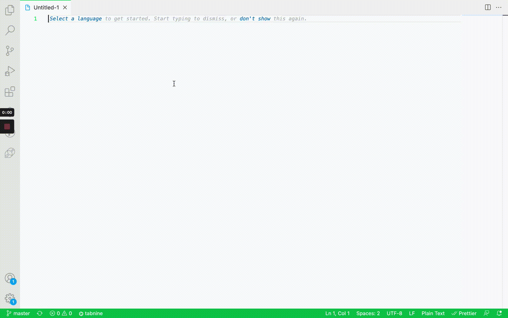

# qr-generator

<div align="center">


</div>

## About The Project

An extension that you can use to generate a QR Code.



## Getting Started

Install the dependencies:

```sh
$ npm install
// or
$ yarn
```

## Built With

- JavaScript
- [qrcode-generator](https://github.com/kazuhikoarase/qrcode-generator)

## Contributing

<div align="center">


</div>

Contributions are what make the Open Source community such an amazing place to learn, inspire, and create. Any contributions you make are **greatly appreciated**.

If you have a suggestion that would make this better, please fork the repo and create a Pull Request. You can also simply [open an issue](https://github.com/jgalianoz/qr-generator/issues) with the tag _enhancement_.

Don't forget to **give the project a star ⭐!** Thanks again!

1. Fork the project

2. Clone the repository

```bash
git clone https://github.com/username/qr-generator.git
// or
git clone git@github.com:username/qr-generator.git

```

3. Create your Feature Branch

```bash
git checkout -b feature/example
```

4. Push to the Branch

```bash
git push origin feature/example
```

5. Open a Pull Request

## Credits

Readme template based on [codi.link](https://github.com/midudev/codi.link/) - [@midudev](https://twitter.com/midudev)

## License

Distributed under the MIT License. See `LICENSE` for more information.

## Contact 📮

**Manuel Galindez**
[@jgalianoz](https://twitter.com/jgalianoz) - jgalianoz.dev@gmail.com
